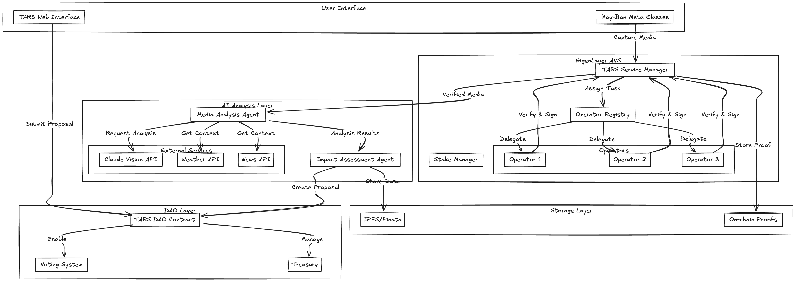

# TARS - Transformative Action Recognition System

TARS is a decentralized platform that revolutionizes social impact verification through AI-driven analysis and DAO governance. By combining EigenLayer's AVS (Actively Validated Service) with Ray-Ban Meta smart glasses, we create a trustless pipeline from real-world observation to on-chain action.



## Demo

Watch our demo video to see TARS in action:
[🎥 TARS Demo Video](https://screen.studio/share/6EVVyVKl)

## Core Components

### 1. Verification Layer (EigenLayer AVS)
- Custom AVS for media authenticity verification
- Decentralized operator network with staking
- Cryptographic proof generation
- [Detailed AVS Setup & Documentation](https://github.com/narasim-teja/tars-AVS-fork-of-Hello-World-AVS-)

### 2. AI Analysis Layer
- Real-time photo/video analysis using Claude Vision
- Location-based context integration
- Weather data analysis
- News correlation for social impact
- Impact score calculation

### 3. DAO Governance (Arbitrum)
- Automated proposal generation
- Community voting system
- Treasury management
- [Smart Contract (Arbitrum Sepolia)](https://sepolia.arbiscan.io/address/0x24253Bcb1B99a80D521c72717337BaDcfe5C2C40)

## Technical Stack

### Hardware Integration
- Ray-Ban Meta Smart Glasses
  - Photo/video capture
  - GPS location tracking
  - Real-time data streaming

### Blockchain Infrastructure
- EigenLayer for AVS and restaking
- Arbitrum Sepolia for DAO contracts
- IPFS/Pinata for decentralized storage

### AI & Analysis
- Claude Vision API for media analysis
- OpenWeatherMap API for environmental context
- NewsAPI for social impact correlation
- Custom TypeScript agents for orchestration

## Hackathon Track Qualifications

### EigenLayer Track
TARS leverages EigenLayer's AVS infrastructure to create a trustless media verification system:

1. **Open-source Implementation**
   - Complete codebase available on [GitHub](https://github.com/narasim-teja/tars-AVS-fork-of-Hello-World-AVS-)
   - Well-documented code with clear architecture

2. **Architecture Documentation**
   - Comprehensive system architecture diagrams
   - Detailed AVS integration documentation
   - Clear operator setup instructions
   - Step-by-step deployment guides

3. **Working Proof-of-Concept**
   - Functional AVS for media verification
   - Live operator network on testnet
   - Demonstrable restaking integration
   - [Watch Demo](https://screen.studio/share/6EVVyVKl)

### Arbitrum Track
TARS demonstrates innovative AI integration on Arbitrum Sepolia:

1. **Deployment**
   - Smart contracts live on [Arbitrum Sepolia](https://sepolia.arbiscan.io/address/0x24253Bcb1B99a80D521c72717337BaDcfe5C2C40)
   - Fully functional DAO governance system
   - Optimized for L2 performance

2. **AI Integration**
   - Claude Vision for media analysis
   - Automated proposal generation
   - Context-aware impact assessment
   - Real-time data processing

3. **Smart Contract Features**
   - Automated proposal creation from AI analysis
   - Democratic voting system
   - Treasury management
   - Multi-signature security

### Nethermind Track
TARS pushes boundaries in AI-blockchain integration:

1. **Original Innovation**
   - First AVS system for social impact verification
   - Novel combination of AI analysis and on-chain governance
   - Unique approach to trustless media validation

2. **End-to-End Functionality**
   - Complete pipeline from media capture to DAO proposal
   - Working frontend interface
   - Integrated AI analysis system
   - On-chain voting mechanism

3. **Learning Journey**
   - Documented development process
   - Technical challenges and solutions
   - Integration insights
   - Performance optimizations

4. **Creative AI Implementation**
   - AI-powered media analysis
   - Automated impact assessment
   - Context-aware proposal generation
   - Multi-agent system architecture

5. **User Experience**
   - Intuitive web interface
   - Clear user flows
   - Transparent verification process
   - Accessible DAO participation

## Quick Start

1. Clone the repository:
```bash
git clone https://github.com/narasim-teja/tars
cd tars
```

2. Install dependencies:
```bash
pnpm install
```

3. Configure environment:
```bash
cp .env.example .env
```

Required API Keys:
```
ANTHROPIC_API_KEY=           # For Claude Vision
PINATA_JWT=                  # For IPFS storage
OPEN_WEATHER_API_KEY=        # For weather data
NEWS_API_KEY=                # For news context
EIGENLAYER_RPC_URL=         # Your RPC endpoint
OPERATOR_PRIVATE_KEY=        # Operator key
SERVICE_MANAGER_ADDRESS=     # Deployed service manager
```

4. Start the services:
```bash
# Start the frontend
pnpm run start:frontend

# Start the AI agents
pnpm run start:agent-impact
pnpm run start:agent-photo
```

## Detailed Setup

For detailed AVS setup and operation instructions, please refer to our [AVS Documentation](https://github.com/narasim-teja/tars-AVS-fork-of-Hello-World-AVS-).

## Development

### Local Development
```bash
pnpm run dev
```

## Acknowledgments

- EigenLayer for AVS infrastructure
- Arbitrum for DAO deployment platform
- Claude Vision for AI analysis
- Meta for Ray-Ban smart glasses integration
- OpenWeather & NewsAPI for contextual data